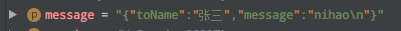
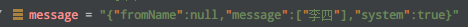

## 基于的一款聊天软件

> 环境配置：

### 项目介绍

- 登录模块
- 进入后显示在线用户（类似好友功能）
- 一对一聊天
- 系统广播

### TODO

- 前端界面修正
- 输入框功能丰富
  - 传文件
  - 表情
  - 聊天记录查询
  - ……

- 数据库介入（数据库表设计）
  - 数据库脚本（自动创建）
  - 聊天记录
  - 用户信息

### 用户之间发送消息

- 用户之间发送信息格式

- 系统发送信息格式

